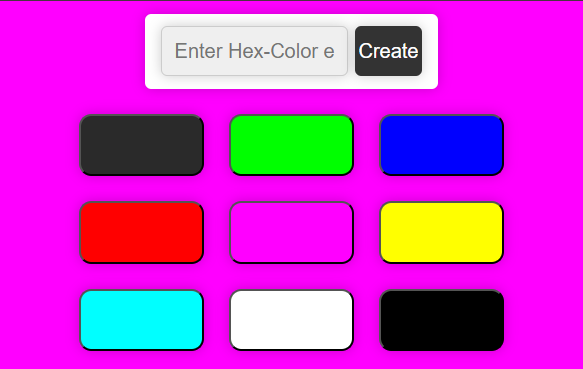

# Background Change with Buttons

- [Live demo](https://jay-govind-kumar.github.io/chai-cohort/projects/Background%20Color%20Change/)
  

This project aims to create a dynamic background change using HTML, CSS, and JavaScript. Users can provide a hex color code to create a button of that color, which when clicked, changes the background color of the page.

## Usage

To use this project, follow these steps:

1. Clone the repository: `git clone `
2. Open the project folder.
3. Open the `index.html` file in your preferred web browser.

## Contributing

- Contributions are welcome! If you have any suggestions, improvements, or bug fixes, feel free to open an issue or submit a pull request.