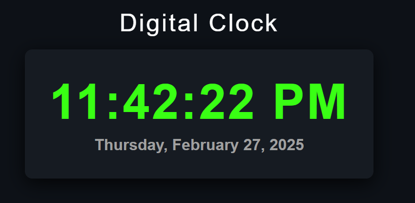

# Digital Clock

- [Live demo](https://jay-govind-kumar.github.io/chai-cohort/projects/Digital%20Clock/)
 

This project aims to create a digital clock using HTML, CSS, and JavaScript. The clock displays the current time and date in a user-friendly format.

## Usage
To use this project, follow these steps:

1. Clone the repository: `git clone `
2. Open the project folder.
3. Open the `index.html` file in your preferred web browser.

## Contributing
- Contributions are welcome! If you have any suggestions, improvements, or bug fixes, feel free to open an issue or submit a pull request.