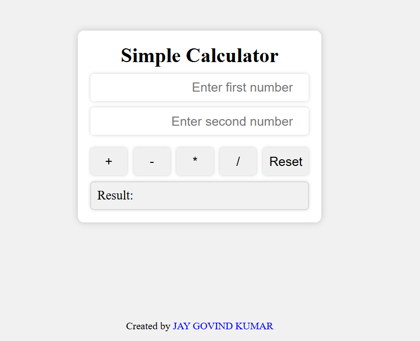

# Simple Calculator

- [Live demo](https://jay-govind-kumar.github.io/chai-cohort/projects/Simple%20Calculator/)
  

This project aims to create a simple calculator using HTML, CSS, and JavaScript. The calculator allows users to perform basic arithmetic operations such as addition, subtraction, multiplication, and division.

## Usage

To use this project, follow these steps:

1. Clone the repository: `git clone `
2. Open the project folder.
3. Open the `index.html` file in your preferred web browser.

## Contributing

- Contributions are welcome! If you have any suggestions, improvements, or bug fixes, feel free to open an issue or submit a pull request.